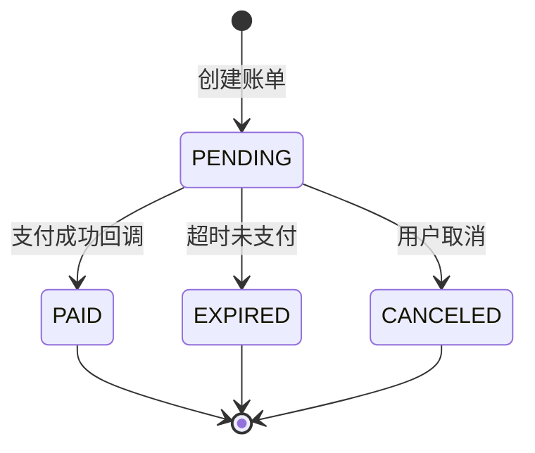
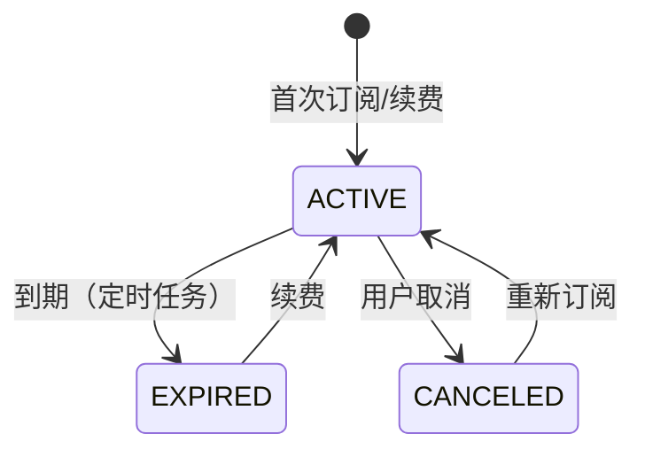
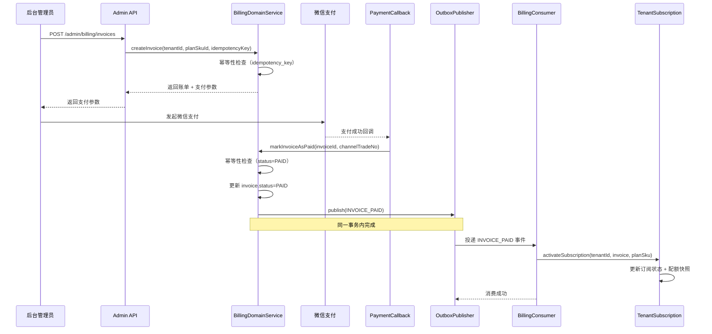

# 订阅计费 Billing V1 - 状态机与对账补偿说明

## 概述

本文档描述 bluecone-app 订阅计费系统的状态机设计、事件流转、对账补偿机制，以及关键设计决策。

---

## 1. 核心概念

### 1.1 三张核心表

| 表名 | 用途 | 关键字段 |
|------|------|---------|
| `bc_plan_sku` | 套餐 SKU 定义 | `plan_code`, `billing_period`, `price_fen`, `features` |
| `bc_billing_invoice` | 订阅账单 | `invoice_no`, `idempotency_key`, `channel_trade_no`, `status` |
| `bc_tenant_subscription` | 租户订阅状态 | `tenant_id`, `current_plan_code`, `subscription_end_at`, `status` |

### 1.2 套餐等级

| 套餐编码 | 套餐名称 | 等级 | 说明 |
|---------|---------|------|------|
| `FREE` | 免费版 | 0 | 永久免费，默认套餐 |
| `BASIC` | 基础版 | 1 | 月付/年付 |
| `PRO` | 专业版 | 2 | 月付/年付 |
| `ENTERPRISE` | 企业版 | 3 | 月付/年付 |

---

## 2. 账单状态机

### 2.1 状态定义

```
PENDING   → 待支付（账单创建后的初始状态）
PAID      → 已支付（支付回调成功）
EXPIRED   → 已过期（超时未支付）
CANCELED  → 已取消（用户取消）
```

### 2.2 状态流转



### 2.3 关键约束

1. **幂等性保证**：
   - `idempotency_key` 唯一索引：防止重复创建账单
   - `channel_trade_no` 唯一索引：防止重复支付回调
   - 状态机保护：`PAID` 状态不可再次流转

2. **金额单位**：
   - 所有金额字段使用 `BIGINT` 存储，单位为"分"
   - 避免浮点数精度问题

---

## 3. 订阅状态机

### 3.1 状态定义

```
ACTIVE    → 生效中（订阅在有效期内）
EXPIRED   → 已过期（订阅到期）
CANCELED  → 已取消（用户主动取消）
```

### 3.2 状态流转



### 3.3 关键约束

1. **租户唯一性**：
   - `tenant_id` 唯一索引：每个租户只有一条订阅记录
   - 续费/升级通过更新同一条记录实现

2. **配额快照**：
   - `current_features` 存储当前生效的配额快照（JSON）
   - PlanGuard 从此字段读取配额，无需关联查询

---

## 4. 事件驱动流程

### 4.1 完整支付流程



### 4.2 关键设计点

1. **先更新账单，后写 Outbox**：
   - 支付回调中，先将 `invoice.status` 更新为 `PAID`
   - 然后在同一事务内写入 Outbox 事件
   - 保证账单状态与事件的一致性

2. **订阅生效由消费者完成**：
   - 支付回调不直接更新订阅表
   - 通过 Outbox 事件异步解耦
   - 消费者 `BillingConsumer` 负责激活订阅

3. **幂等性保证**：
   - 账单创建：`idempotency_key` 唯一约束
   - 支付回调：`channel_trade_no` 唯一约束 + 状态机保护
   - 消费者：`bc_event_consume_log` 表保证消费幂等

---

## 5. 对账补偿机制

### 5.1 补偿场景

| 场景 | 原因 | 补偿方式 |
|------|------|---------|
| 支付成功但订阅未生效 | 消费者宕机/消费失败 | `BillingReconcileJob` 补发 Outbox 事件 |
| 订阅到期未降级 | 定时任务未执行/执行失败 | `SubscriptionExpireJob` 扫描并降级 |
| Outbox 事件未投递 | Outbox 投递失败 | `OutboxPublisherJob` 重试投递 |

### 5.2 BillingReconcileJob（对账补偿）

**执行频率**：每 30 分钟一次

**补偿逻辑**：
1. 扫描最近 24 小时内 `status=PAID` 的账单
2. 检查对应租户的订阅是否已生效（`last_invoice_id` 是否匹配）
3. 如果未生效，补发 `INVOICE_PAID` 事件到 Outbox
4. 消费者重新消费，完成订阅激活

**幂等性保证**：
- 消费者通过 `bc_event_consume_log` 表保证重复消费幂等
- 订阅激活逻辑本身支持幂等（更新操作）

### 5.3 SubscriptionExpireJob（到期降级）

**执行频率**：每小时一次

**降级逻辑**：
1. 扫描 `status=ACTIVE` 且 `subscription_end_at < NOW()` 的订阅
2. 查询免费版套餐配置
3. 更新订阅为免费版，状态改为 `EXPIRED`
4. PlanGuard 自动读取新的配额限制

---

## 6. PlanGuard 集成

### 6.1 配额读取流程

```java
// 旧方式（手工维护）
TenantPlan tenantPlan = tenantPlanMapper.selectByTenantId(tenantId);

// 新方式（从订阅读取）
TenantPlanConfig config = subscriptionPlanService.getTenantPlanConfig(tenantId);
int maxStores = config.maxStores();
boolean hasMultiWarehouse = config.hasFeature(Feature.MULTI_WAREHOUSE);
```

### 6.2 配额快照设计

**为什么使用快照？**
- 避免每次查询都关联 `bc_plan_sku` 表
- 支持历史套餐配置变更（用户订阅时的配额不受后续套餐调整影响）
- 提升查询性能

**快照更新时机**：
- 首次订阅时
- 续费时
- 升级/降级时
- 到期降级到免费版时

---

## 7. 测试覆盖

### 7.1 单元测试

| 测试用例 | 验证点 |
|---------|--------|
| `testCreateInvoice_Idempotent` | 账单创建幂等性 |
| `testMarkInvoiceAsPaid_Idempotent` | 支付回调幂等性 |
| `testActivateSubscription_FirstTime` | 首次订阅激活 |
| `testActivateSubscription_Renewal` | 续费延长周期 |
| `testDowngradeToFree` | 到期降级到免费版 |

### 7.2 集成测试建议

1. **回调重放测试**：
   - 模拟微信支付回调重复发送
   - 验证账单状态不会重复更新
   - 验证订阅不会重复激活

2. **宕机恢复测试**：
   - 模拟支付回调成功后，消费者宕机
   - 验证 `BillingReconcileJob` 能补发事件
   - 验证订阅最终生效

3. **到期降级测试**：
   - 创建已过期的订阅
   - 执行 `SubscriptionExpireJob`
   - 验证订阅降级到免费版
   - 验证 PlanGuard 正确拦截超出配额的操作

---

## 8. 运维监控

### 8.1 关键指标

| 指标 | 说明 | 告警阈值 |
|------|------|---------|
| 账单支付成功率 | `PAID / (PAID + FAILED)` | < 95% |
| 订阅激活延迟 | 支付成功到订阅生效的时间 | > 5 分钟 |
| 对账补偿次数 | `BillingReconcileJob` 补发事件次数 | > 10 次/天 |
| 到期未降级数量 | `status=ACTIVE` 且已过期的订阅数 | > 0 |

### 8.2 日志关键字

| 关键字 | 场景 |
|--------|------|
| `[billing-callback]` | 支付回调处理 |
| `[billing-consumer]` | 订阅激活消费 |
| `[billing-reconcile-job]` | 对账补偿任务 |
| `[subscription-expire-job]` | 到期降级任务 |
| `[subscription-plan]` | 配额查询 |

---

## 9. 常见问题

### Q1: 支付成功但订阅未生效怎么办？

**A**: 系统有两层保障：
1. 实时保障：Outbox 事件自动重试（最多 10 次）
2. 延迟保障：`BillingReconcileJob` 每 30 分钟扫描并补发事件

### Q2: 用户订阅到期后会发生什么？

**A**: 
1. `SubscriptionExpireJob` 每小时扫描一次
2. 自动降级到免费版，状态改为 `EXPIRED`
3. PlanGuard 自动读取免费版配额，超出配额的功能被拦截

### Q3: 如何处理账单重复创建？

**A**: 
- 前端/后台需要生成唯一的 `idempotency_key`（如 UUID）
- 数据库唯一索引保证同一 `idempotency_key` 只能创建一次
- 重复请求返回已有账单

### Q4: 如何处理微信支付回调重复发送？

**A**: 
- `channel_trade_no` 唯一索引保证同一笔支付只能成功一次
- 状态机保护：`PAID` 状态不可再次流转
- 消费者幂等：`bc_event_consume_log` 表保证消费幂等

---

## 10. 未来优化方向

1. **支付渠道扩展**：
   - 当前仅支持微信支付
   - 可扩展支付宝、银行卡等渠道

2. **套餐升降级策略**：
   - 当前仅支持到期降级到免费版
   - 可支持中途升级（按比例退款）、降级（按比例补差价）

3. **发票管理**：
   - 支持电子发票生成
   - 支持发票历史查询

4. **优惠码/折扣**：
   - 支持优惠码抵扣
   - 支持首单折扣、续费折扣

5. **试用期**：
   - 支持新用户免费试用 N 天
   - 试用期结束自动降级或提醒续费

---

## 附录：数据库索引设计

### bc_billing_invoice

| 索引名 | 字段 | 用途 |
|--------|------|------|
| `uk_invoice_no` | `invoice_no` | 账单号唯一性 |
| `uk_idempotency_key` | `idempotency_key` | 创建幂等性 |
| `uk_channel_trade_no` | `channel_trade_no` | 支付幂等性 |
| `idx_tenant_status` | `tenant_id, status` | 租户账单查询 |
| `idx_created_at` | `created_at` | 时间范围查询 |

### bc_tenant_subscription

| 索引名 | 字段 | 用途 |
|--------|------|------|
| `uk_tenant_id` | `tenant_id` | 租户唯一性 |
| `idx_status_end_at` | `status, subscription_end_at` | 到期扫描 |
| `idx_plan_code` | `current_plan_code` | 套餐统计 |

---

**文档版本**: V1.0  
**最后更新**: 2025-12-19  
**作者**: Bluecone Team
